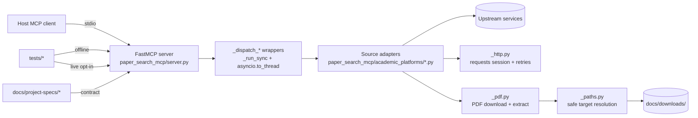

# Codebase Map

> Structural navigation for `paper-search-mcp`.

This repo is a Python MCP server that exposes `search_*`, `download_*`, and
`read_*_paper` tools over stdio. The core design choice is source-by-source
adapters with explicitly documented capability boundaries.

## System Overview

- Runtime entrypoint: `paper_search_mcp/server.py` (`FastMCP("paper_search_server")`).
- Dispatch model: async wrappers run sync adapter code via `asyncio.to_thread`
  under a shared semaphore (`_MAX_CONCURRENT_TOOL_CALLS = 8`).
- Downloads: all download/read tools ignore user `save_path` and write under
  `docs/downloads/` via `paper_search_mcp/_paths.py`.
- Validation: offline unit tests deny network by default; live MCP smoke is
  opt-in (`PAPER_SEARCH_LIVE_TESTS=1`).
- Sensitive surface: Sci-Hub helper code exists, but it is not part of the
  default supported path.



## Repository Layout

```text
paper-search-mcp/
  paper_search_mcp/           # Runtime MCP server package
  scripts/                    # Operational checks and benchmarks
  tests/                      # Offline-by-default tests + opt-in live MCP smoke
  docs/                       # Durable docs: specs, playbooks, plans, references
  .github/workflows/          # CI + publish workflows
```

## Entry Surfaces

- `README.md` — Quick start, development workflow, environment variables.
- `AGENTS.md` — Repo-local invariants and read order.
- `ARCHITECTURE.md` — System shape and negative space.
- `pyproject.toml` — Packaging metadata (hatchling; `paper-search-mcp`).
- `uv.lock` — Locked dependencies (used by Docker build).
- `smithery.yaml` — Smithery stdio start command (`python -m paper_search_mcp.server`).
- `Dockerfile` — Container build (installs deps with `uv sync --locked`).
- `.github/workflows/ci.yml` — Offline gate in CI.
- `.github/workflows/publish.yml` — Tag-driven build + PyPI publish (offline
  gate first).

## Runtime Package

### `paper_search_mcp/server.py`

#### Server role

- Owns the public MCP surface via `mcp = FastMCP("paper_search_server")`.
- Registers tools using `@mcp.tool()` and routes calls to per-source adapter
  classes in `paper_search_mcp/academic_platforms/`.

#### Dispatch and concurrency

- Sync adapter work runs under `_TOOL_SEMAPHORE` and `asyncio.to_thread`
  (`_run_sync`, `_dispatch_sync`, `_dispatch_search`, `_dispatch_download`,
  `_dispatch_read`).

#### Canonical download routing

- `_canonical_save_path()` forces the download/read root to `docs/downloads/`
  regardless of user `save_path`. Filesystem safety is implemented in
  `paper_search_mcp/_paths.py`.

#### Public MCP tools

- Search:
  - `search_arxiv`, `search_pubmed`, `search_pmc`, `search_biorxiv`,
    `search_medrxiv`, `search_google_scholar`, `search_iacr`,
    `search_semantic`, `search_crossref`
- Download:
  - `download_arxiv`, `download_biorxiv`, `download_medrxiv`, `download_iacr`,
    `download_semantic`
  - `download_pubmed`, `download_crossref` return limitation strings via
    `NotImplementedError` fallback
  - `download_pmc` returns a structured `LIMITATION:` payload
- Read:
  - `read_arxiv_paper`, `read_biorxiv_paper`, `read_medrxiv_paper`,
    `read_iacr_paper`, `read_semantic_paper`
  - `read_pubmed_paper`, `read_crossref_paper` return limitation strings
  - `read_pmc_paper` returns a structured `LIMITATION:` payload
- Lookup:
  - `get_crossref_paper_by_doi`

### `paper_search_mcp/paper.py`

- `Paper` dataclass defines one normalized paper record.
- `Paper.to_dict()` is the serialization contract used by the MCP tools
  (`server.py:_serialize_search_results`); list fields are joined with `;`
  (semicolon + space) and `extra` is stringified.

### Shared utilities

- `paper_search_mcp/_paths.py` — safe download root under `docs/downloads/`:
  `resolve_download_target()` + `sanitize_filename()` (hashed suffix).
- `paper_search_mcp/_http.py` — shared `requests.Session` configuration:
  retry policy (`RetryPolicy`), pooling, and `request_with_retries()`.
- `paper_search_mcp/_pdf.py` — streamed PDF download + text extraction:
  `download_pdf_file()` and `extract_pdf_text()`.

### `paper_search_mcp/academic_platforms/`

#### Adapter contract and shared base

- `_base.py` — `PaperSource` abstract contract (`search`, `download_pdf`,
  `read_paper`); return/error semantics are intentionally not fully standardized.
- `_preprint_base.py` — `PreprintSearcherBase` shared implementation for
  bioRxiv/medRxiv including proxy toggle (`PAPER_SEARCH_DISABLE_PROXIES=1`).

#### Adapters

- `arxiv.py` — `ArxivSearcher` (feed API; download/read via `_pdf.py`).
- `biorxiv.py` — `BioRxivSearcher` (inherits `PreprintSearcherBase`).
- `medrxiv.py` — `MedRxivSearcher` (inherits `PreprintSearcherBase`).
- `pubmed.py` — `PubMedSearcher` (metadata; no PDF download).
- `pmc.py` — `PMCSearcher` (metadata; download/read return `LIMITATION:` JSON).
- `crossref.py` — `CrossRefSearcher` + `get_paper_by_doi()` (metadata; no PDF download).
- `semantic.py` — `SemanticSearcher` (API; optional `SEMANTIC_SCHOLAR_API_KEY`;
  download/read only when an open-access PDF URL is available).
- `google_scholar.py` — `GoogleScholarSearcher` (HTML scraping; metadata-only).
- `iacr.py` — `IACRSearcher` (HTML scraping; supports download/read).
- `sci_hub.py` — `SciHubFetcher` legacy helper (not a `PaperSource`; sensitive
  surface; uses `verify=False`).

#### Notes

- `academic_platforms/hub.py` is currently empty (no adapter registry here).
- Keep capability claims aligned with
  `docs/project-specs/source-capability-matrix.md`.

## Scripts

- `scripts/health_check_search_tools.py` — Live MCP `search_*` tool health
  check that spawns the server over stdio; includes optional HTTP preflight and
  can render a Chinese Markdown report.
- `scripts/benchmarks/tool_latency_smoke.py` — Deterministic dry-run latency
  harness used by `tests/test_performance_smoke.py`; supports `--live` as an
  observational mode.

## Tests

### Offline by default

- `tests/_offline.py` provides `OfflineTestCase` and `deny_network()` to fail
  fast on outbound network access. Offline fixtures live in `tests/fixtures/`.

### Opt-in live MCP smoke

- `tests/_mcp_live.py` starts the server over stdio and provides helpers for
  parsing tool output and cleaning up `docs/downloads/`.
- `tests/test_mcp_live.py` runs protocol-level smoke when
  `PAPER_SEARCH_LIVE_TESTS=1` and uses the capability matrix doc to select
  per-source test expectations.

### Key contract tests

- `tests/test_server.py` — tool registration snapshot + schema pinning +
  canonical save-path enforcement.
- `tests/test_search_contract.py` — no-hit vs failure propagation semantics.
- `tests/test_adapter_contract.py` — adapter constructability + method
  signatures.
- `tests/test_http.py`, `tests/test_http_resilience.py` — shared retry/pooling
  invariants.
- `tests/test_pdf_utils.py`, `tests/test_paths.py` — PDF + safe-path contracts.
- `tests/test_performance_smoke.py` — dry-run latency thresholds.

## Durable Docs

- `docs/project-specs/` — behavior contracts and capability matrix (source of
  truth for tool shape and limitation payload format).
- `docs/playbooks/` — how to validate and release safely.
- `docs/design-docs/` — governance and template adoption.
- `docs/PLANS.md` + `docs/exec-plans/` — accepted multi-step work and evidence.
- `docs/references/` — upstream/service references.

## Navigation Guide

- Change the MCP tool surface or routing: `paper_search_mcp/server.py` and
  `docs/project-specs/mcp-tool-contract.md`
- Add or update a source adapter: `paper_search_mcp/academic_platforms/` and
  `docs/project-specs/source-capability-matrix.md`
- Tighten download/read safety: `paper_search_mcp/_paths.py` and
  `tests/test_paths.py`
- Adjust retries/timeouts/pooling: `paper_search_mcp/_http.py` and
  `tests/test_http.py`
- Debug PDF parsing/download issues: `paper_search_mcp/_pdf.py` and
  `tests/test_pdf_utils.py`
- Update validation and release procedures: `docs/playbooks/validation.md` and
  `docs/playbooks/release.md`
